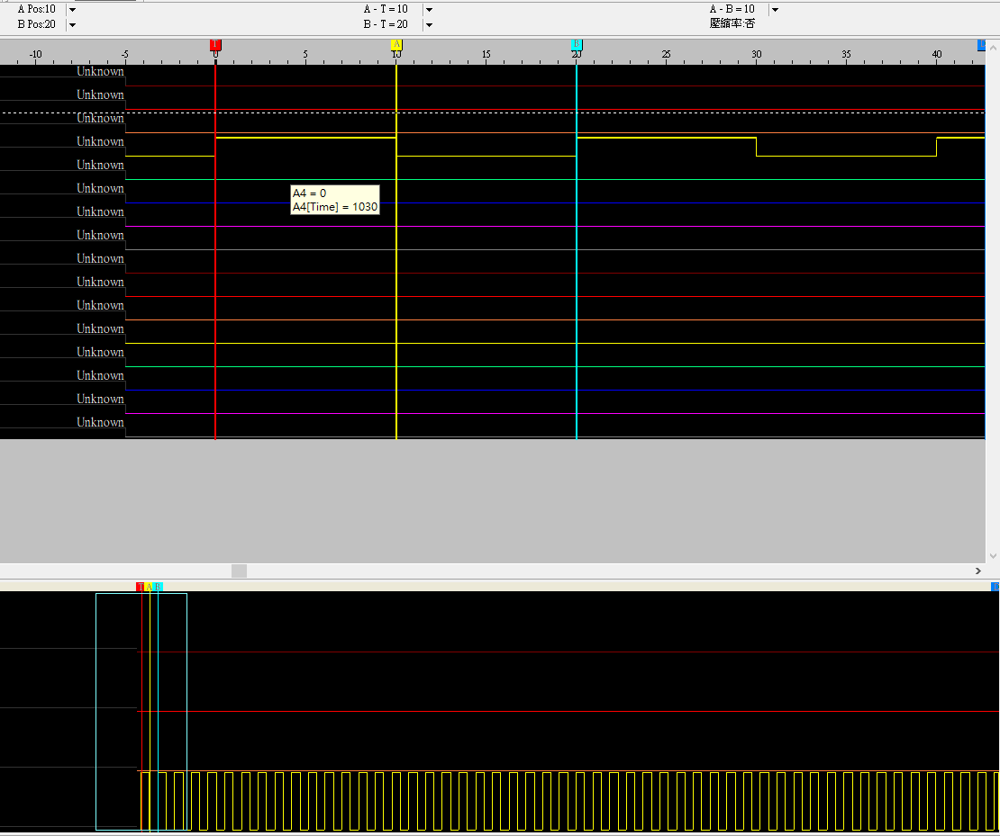

# ESLAB_hw5

### How to run

##### STM32L4
* 可以直接將整個project載下，用 mbed studio 將程式燒錄在 STM32L4 開發板上。
* 將 STM32L4 連接 PC ，於 mbed studio 的 terminal 輸入指令。

##### ZeroPlus Logic Cube Analyzer
* 在 Windows 系統的電腦安裝並執行 ZeroPlus Logic Cube Analyzer。

##### Hardware Setup
* 將 STM32L4 上 CH1 的 PWM 連接到 ZeroPlus Logic Cube 的 A3。
* 將 STM32L4 與 ZeroPlus Logic Cube 的 GND 連結。

### Main Functions
* Client (PC) control the LEDs on STM32L4.
* Show wave form on logic analyzer.

##### Control LEDs Brightness
* 功能：”u”, “d”
* 當成功啟用功能，會印出所下指令（"u"/"d") 以及亮度。
* 執行時可同時於 Logic Analyzer 觀察波形變化。

### Demo Result

